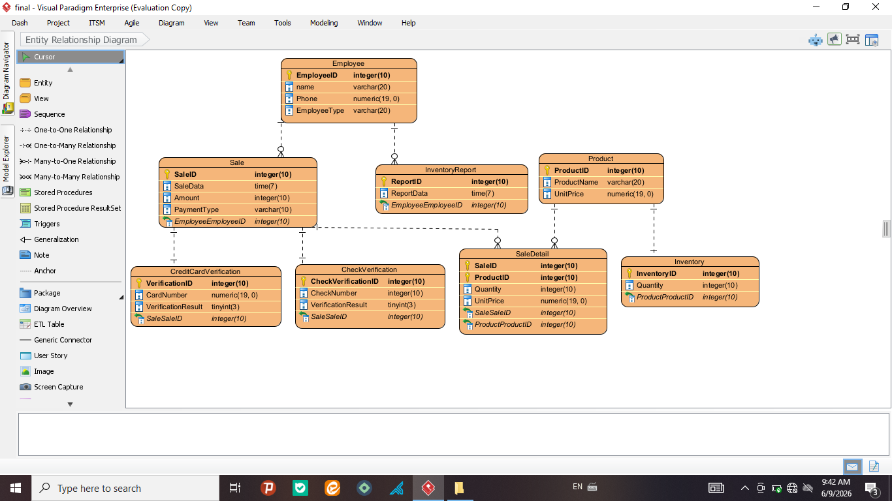
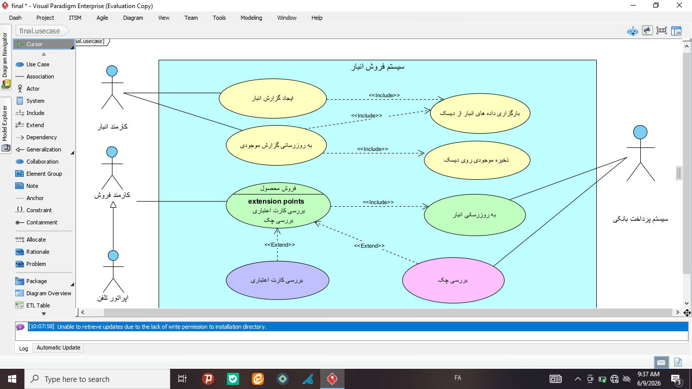
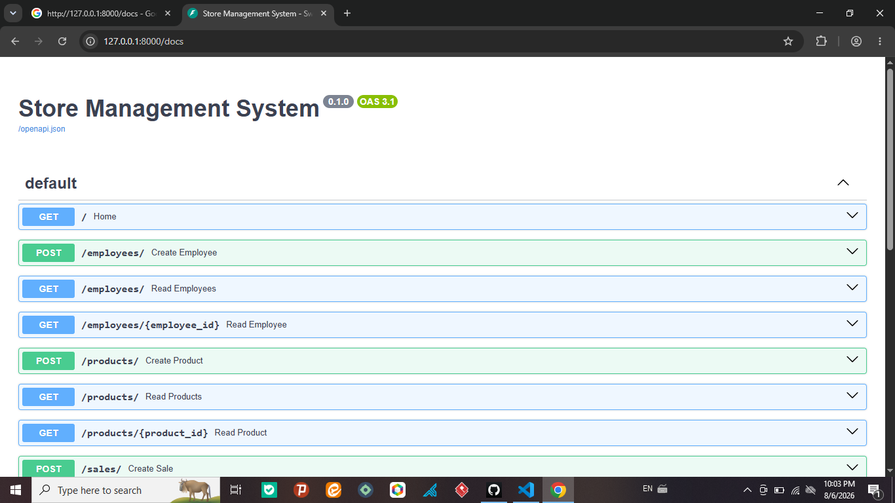

# 🏪 Store Management System

A RESTful Store Management System built with **FastAPI**, **SQLAlchemy**, **Pydantic**, and **SQLite**.

This project provides a backend API for managing employees, products, inventory, sales, payment methods, and inventory reports. It follows REST principles and demonstrates clean API design using FastAPI.

---

## ✨ Features

- Employee Management
- Product Management
- Inventory Management
- Sales Management
- Sale Details Management
- Payment Verification
- Inventory Reports
- RESTful API Architecture
- Request & Response Validation using Pydantic
- SQLAlchemy ORM
- SQLite Database
- Docker Support
- Interactive API Documentation (Swagger UI)

---

## 🛠 Technologies

- Python 3
- FastAPI
- SQLAlchemy
- Pydantic
- SQLite
- Uvicorn
- Docker

---

## 📂 Project Structure

```
StoreManagementSystem/
│
├── images/
│   ├── swagger.png
│   ├── er-diagram.png
│   └── use-case.png
│
├── database.py
├── main.py
├── models.py
├── schemas.py
├── requirements.txt
├── Dockerfile
├── .gitignore
└── README.md
```

---

## 🗄 Database Design

The system consists of the following entities:

- Employee
- Product
- Inventory
- Sale
- Sale Detail
- Payment Method
- Verification
- Inventory Report
- Inventory Report Detail

### Entity Relationship Diagram



---

## 📋 Use Case Diagram

The system supports different user roles including:

- Sales Employee
- Inventory Employee
- Telephone Operator
- Banking Payment System



---

## 🚀 API Endpoints

### Employees

- Create Employee
- Get All Employees
- Get Employee by ID

### Products

- Create Product
- Get All Products
- Get Product by ID

### Sales

- Create Sale
- Get All Sales

---

## 📑 API Documentation

Interactive API documentation is available through Swagger UI.

```
http://localhost:8000/docs
```

### Swagger



---

## ⚙ Installation

Clone the repository

```bash
git clone https://github.com/elhamjln/StoreManagementSystem.git
```

Move to the project directory

```bash
cd StoreManagementSystem
```

Install dependencies

```bash
pip install -r requirements.txt
```

Run the application

```bash
uvicorn main:app --reload
```

---

## 🐳 Docker

Build the Docker image

```bash
docker build -t store-management-system .
```

Run the container

```bash
docker run -p 8000:8000 store-management-system
```

---

## 📌 Future Improvements

- Authentication & Authorization
- JWT Security
- Inventory Auto Update
- Product Search & Filtering
- Reporting Dashboard
- PostgreSQL Support
- Unit Testing
- CI/CD Pipeline

---

## 👩‍💻 Author

**Elham Jalilian**

GitHub:

https://github.com/elhamjln

---

## 📄 License

This project is licensed under the MIT License.
